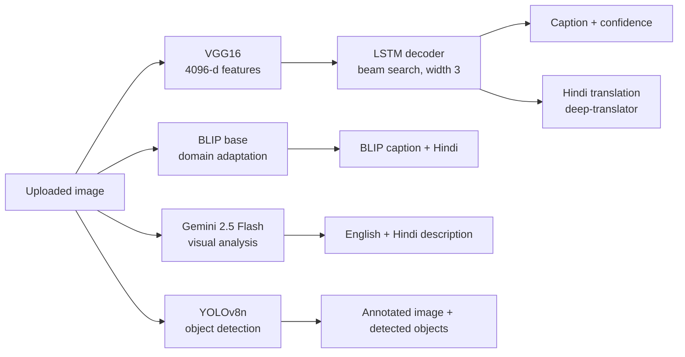

# 🖼️ Hybrid Image Caption Generator

**Upload an image and compare four AI systems side by side:** YOLOv8 object detection, a CNN-LSTM captioner trained from scratch, Salesforce BLIP, and Gemini for a detailed English + Hindi description.


**Jump to:** [The problem](#-the-problem) · [Pipeline](#-pipeline) · [Results](#-results) · [Run it](#-run-it) · [Limitations](#-limitations)

---

## 🎯 The problem

Captioning models trained on a small dataset (here, Flickr8k) work on photos like their training data but fail on **out-of-domain images**: digital art, anime, memes, screenshots. This is the *domain gap*.

This project keeps a custom-trained model to learn the fundamentals, and puts it next to stronger pre-trained models so the gap is visible in one dashboard.

---

## 🏗️ Pipeline



| Stage | Model | Role |
|---|---|---|
| Detection | YOLOv8n (Ultralytics) | Lists objects with confidence scores |
| Custom captioner | VGG16 (fc2 features) → LSTM | Trained from scratch on Flickr8k; decoded with beam search (width 3) |
| Domain adaptation | `Salesforce/blip-image-captioning-base` | Handles images the custom model cannot |
| Contextual analysis | Gemini 2.5 Flash | Detailed description, English and formal Hindi |
| Translation | deep-translator | Hindi versions of the captions |

The Streamlit app has two tabs: **Live Analysis Dashboard** (run the pipeline, view the YOLO overlay, all captions and the confidence score) and **Session History**.

---

## 🧪 How the custom model was trained

| Item | Value |
|---|---|
| Dataset | Flickr8k: 8,091 images, 40,456 captions ([Kaggle](https://www.kaggle.com/datasets/adityajn105/flickr8k)) |
| Image features | VGG16, second-to-last layer, 4,096 dimensions |
| Vocabulary | 8,485 words |
| Max caption length | 35 tokens |
| Architecture | Image branch (dropout 0.4 → dense 256) merged with text branch (embedding 256 → dropout → LSTM 256), then dense + softmax. 5,992,741 parameters |
| Training | 5 epochs, batch size 128, memory-efficient Python data generator; steps per epoch set to half of the computed total |
| Split | 90% train / 10% test (810 test images) |

---

## 📊 Results

BLEU on the 810 held-out images (notebook evaluation, greedy decoding):

| Metric | Score |
|---|---|
| BLEU-1 | **0.519** |
| BLEU-2 | **0.288** |

These are modest numbers, as expected from a small model trained for 5 epochs on 8k images. The point of the hybrid design is that BLIP and Gemini cover what this model cannot.

---

## 🚀 Run it

```bash
git clone https://github.com/Sajal-10903/Image_Caption_Generator.git
cd Image_Caption_Generator
pip install -r requirements.txt
```

**1. Get the data.** Download the Flickr8k images from the link in `dataset/Images/dataset_link.txt` into `dataset/Images/` (`dataset/captions.txt` is included).

**2. Train the custom model.** Run `Image_Caption_Generator.ipynb` top to bottom. It extracts features, builds the tokenizer, trains the model and saves `image_captioning_model.h5`.

> The trained weights (`image_captioning_model.h5`) are **not included** in this repo, so the app needs this step before it will start. `tokenizer.pkl` and `yolov8n.pt` are included.

**3. Add your Gemini key.** In `app.py`, replace `YOUR_API_KEY_HERE` with your key from [Google AI Studio](https://aistudio.google.com/). Never commit a real key.

**4. Launch.**

```bash
streamlit run app.py
```

BLIP weights download from Hugging Face on first run.

---

## 📂 Project structure

```text
Image_Caption_Generator/
├── Image_Caption_Generator.ipynb   # feature extraction, training, BLEU evaluation
├── app.py                          # Streamlit hybrid inference app
├── tokenizer.pkl                   # fitted tokenizer
├── yolov8n.pt                      # YOLOv8 nano weights
├── dataset/                        # captions.txt + image download link
└── requirements.txt
```

---

## ⚠️ Limitations

- The custom CNN-LSTM is small and trained briefly; its captions are often generic. Use the BLIP and Gemini outputs as the quality reference.
- Gemini analysis and Hindi translation need internet access; translation uses a third-party wrapper, so quality is not human-verified.
- BLEU was measured with greedy decoding, while the app uses beam search, so the app's captions are not covered by the reported scores.
- Trained weights are not shipped; you have to run the notebook first.
- No evaluation was run on BLIP or Gemini outputs.

---

**Author:** [Sajal Raj](https://github.com/Sajal-10903) · [Portfolio](https://sajalraj-portfolio.vercel.app) · [LinkedIn](https://www.linkedin.com/in/sajal-raj-456b31252/)
