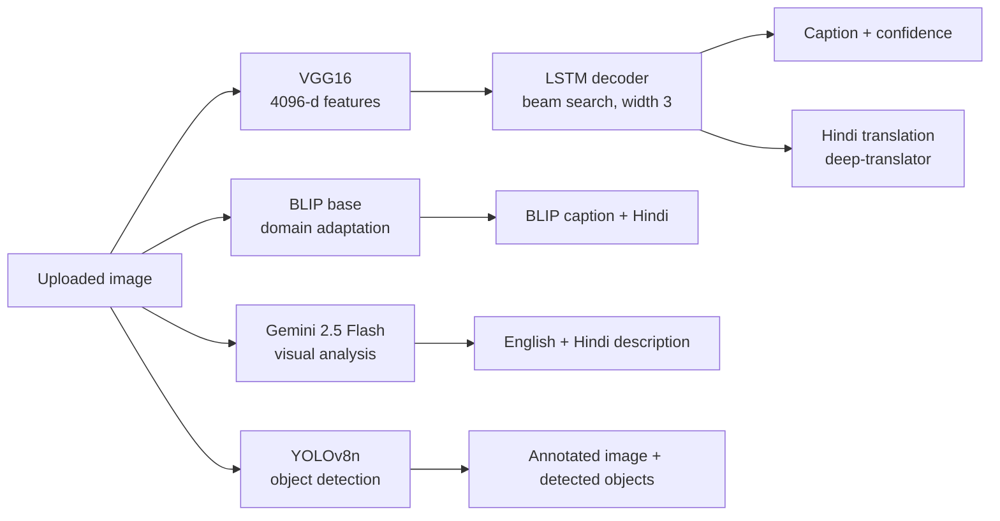

# 🖼️ Hybrid Image Caption Generator

**Upload an image and compare four AI systems side by side:** YOLOv8 object detection, a CNN-LSTM captioner trained from scratch, Salesforce BLIP, and Gemini for a detailed English + Hindi description.


**Jump to:** [The problem](#-the-problem) · [Pipeline](#-pipeline) · [Results](#-results) · [Run it](#-run-it) · [Limitations](#-limitations)

---

## 🎯 The problem

Captioning models trained on a small dataset (here, Flickr8k) work on photos like their training data but fail on **out-of-domain images**: digital art, anime, memes, screenshots. This is the *domain gap*.

This project keeps a custom-trained model to learn the fundamentals, and puts it next to stronger pre-trained models so the gap is visible in one dashboard.

---

## 🏗️ Pipeline



| Stage | Model | Role |
|---|---|---|
| Detection | YOLOv8n (Ultralytics) | Lists objects with confidence scores |
| Custom captioner | VGG16 (fc2 features) → LSTM | Trained from scratch on Flickr8k; decoded with beam search (width 3) |
| Domain adaptation | `Salesforce/blip-image-captioning-base` | Handles images the custom model cannot |
| Contextual analysis | Gemini 2.5 Flash | Detailed description, English and formal Hindi |
| Translation | deep-translator | Hindi versions of the captions |

The Streamlit app has two tabs: **Live Analysis Dashboard** (run the pipeline, view the YOLO overlay, all captions and the confidence score) and **Session History**.

---

## 🧪 How the custom model was trained

| Item | Value |
|---|---|
| Dataset | Flickr8k: 8,091 images, 40,456 captions ([Kaggle](https://www.kaggle.com/datasets/adityajn105/flickr8k)) |
| Image features | VGG16, second-to-last layer, 4,096 dimensions |
| Vocabulary | 8,485 words |
| Max caption length | 35 tokens |
| Architecture | Image branch (dropout 0.4 → dense 256) merged with text branch (embedding 256 → dropout → LSTM 256), then dense + softmax. 5,992,741 parameters |
| Training | 5 epochs, batch size 128, memory-efficient Python data generator; steps per epoch set to half of the computed total |
| Split | 90% train / 10% test (810 test images) |

---

## 📊 Results

BLEU on the 810 held-out images (notebook evaluation, greedy decoding):

| Metric | Score |
|---|---|
| BLEU-1 | **0.519** |
| BLEU-2 | **0.288** |

These are modest numbers, as expected from a small model trained for 5 epochs on 8k images. The point of the hybrid design is that BLIP and Gemini cover what this model cannot.

---

## 🚀 Run it

### Prerequisites

- **Python:** 3.11 recommended (supported with TensorFlow, PyTorch, and Transformers)
- **Virtual Environment:** Strongly recommended

### 1. Clone & Install Dependencies

```bash
git clone https://github.com/Sajal-10903/Hybrid-Image-Caption-Generator.git
cd Hybrid-Image-Caption-Generator

# Create and activate virtual environment
python -m venv .venv
# On Windows (PowerShell):
.venv\Scripts\Activate.ps1
# On Linux/macOS:
source .venv/bin/activate

# Install dependencies
pip install -r requirements.txt
```

### 2. Configure Environment Variables

The application securely reads `GEMINI_API_KEY` from the environment or a local `.env` file (loaded via `python-dotenv`).

```bash
# Copy example configuration template
cp .env.example .env
```

Open `.env` and set your API key from [Google AI Studio](https://aistudio.google.com/):

```dotenv
GEMINI_API_KEY=your_actual_api_key_here
```

*(If you do not configure `GEMINI_API_KEY`, YOLOv8 object detection, BLIP captioning, and Hindi translation remain fully functional; the Gemini contextualization card will display an informational notice instead).*

### 3. Model Weights (`image_captioning_model.h5`)

The project uses multiple models:
- **YOLOv8n** (`yolov8n.pt`): Pre-trained weights included in the repository.
- **BLIP** (`Salesforce/blip-image-captioning-base`): Automatically downloads from Hugging Face on first run.
- **Custom CNN-LSTM** (`image_captioning_model.h5`): 
  - Trained from scratch on Flickr8k features extracted with VGG16.
  - Due to file size (~70 MB), the binary weights are not bundled in Git.
  - To train: Download the Flickr8k images into `dataset/Images/` (see `dataset/Images/dataset_link.txt`) and run `Image_Caption_Generator.ipynb` top to bottom. It will save `image_captioning_model.h5` directly into the project root.
  - Alternatively, if you already have trained weights, place `image_captioning_model.h5` directly in the project root directory.
  - If `image_captioning_model.h5` is not present, the app starts gracefully without crashing, displays an informational notice for the custom model, and runs the other three AI systems (YOLOv8, BLIP, and Gemini).

### 4. Launch Application

```bash
streamlit run app.py
```

---

## 📂 Project structure

```text
Hybrid-Image-Caption-Generator/
├── .env.example                    # Environment template for GEMINI_API_KEY
├── .gitignore                      # Git exclusion rules for artifacts & secrets
├── Image_Caption_Generator.ipynb   # Feature extraction, training, BLEU evaluation
├── app.py                          # Streamlit hybrid inference dashboard
├── tokenizer.pkl                   # Fitted Keras tokenizer (8,485 vocabulary)
├── yolov8n.pt                      # Ultralytics YOLOv8 nano weights
├── dataset/
│   ├── captions.txt                # 40,456 Flickr8k captions
│   └── Images/
│       ├── .gitkeep
│       └── dataset_link.txt        # Link to Kaggle Flickr8k images
└── requirements.txt                # Production dependencies
```

---

## ⚠️ Limitations

- **Custom CNN-LSTM Weights:** Model weights (`image_captioning_model.h5`) are generated by running `Image_Caption_Generator.ipynb` and are not checked into Git history. When absent, the dashboard runs YOLOv8 and BLIP and indicates the custom weights are unpopulated.
- **Gemini LLM Integration:** Requires an active `GEMINI_API_KEY` from Google AI Studio and an internet connection.
- **Hindi Translation:** Relies on `deep-translator` (Google Translate web service), which requires internet connectivity and may occasionally encounter rate limits.
- **BLEU Evaluation:** BLEU was measured in the training notebook using greedy decoding, while the Streamlit application utilizes beam search (width = 3) for inference.

---

**Author:** [Sajal Raj](https://github.com/Sajal-10903) · [Portfolio](https://sajalraj-portfolio.vercel.app) · [LinkedIn](https://www.linkedin.com/in/sajal-raj-456b31252/)
